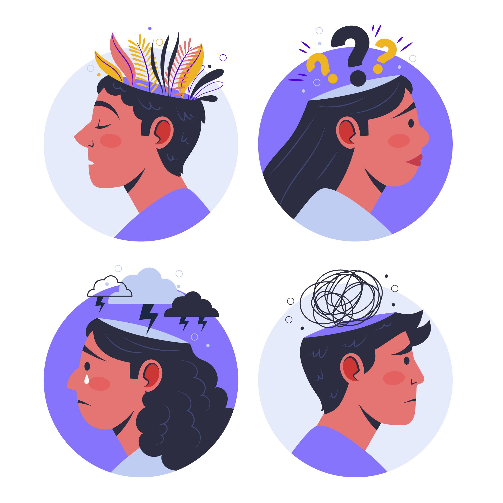
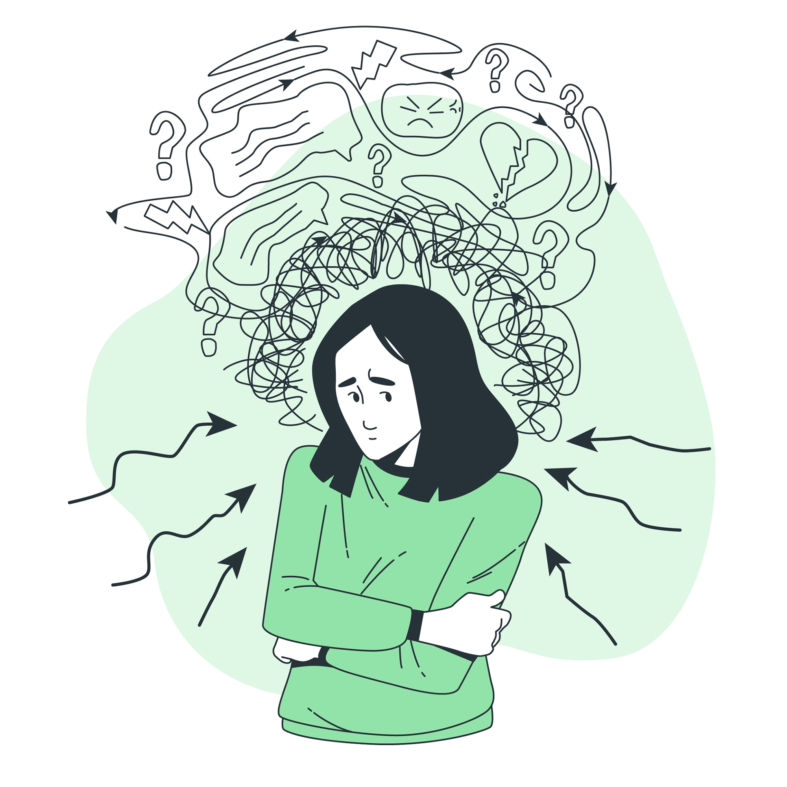
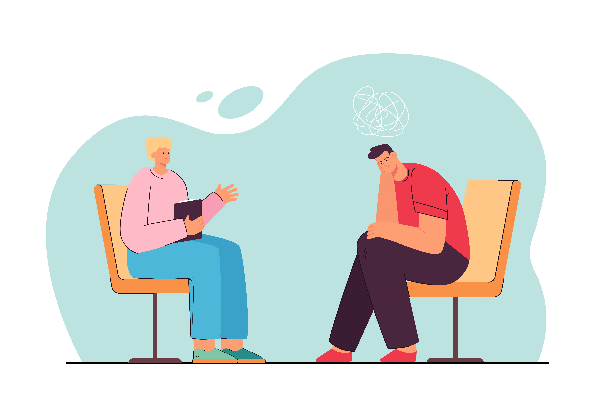

<html>
<head>
    
</head>
<body>
    

        

            <button class='button signins' onclick="location.href='//https://isabellehp.github.io/tri2/';">Sign In Options</button>
            

                <a href="">Sign Up </a>
                <a href="https://isabellehp.github.io/tri2/login/">Log In</a>
                <!-- Add more artist links as needed -->
            

        

        

            <button class='button metaltherapy' onclick="location.href='//https://isabellehp.github.io/tri2/homepage';">Ways To Help Your Mental Health</button>
        

        

            <button class='button more' onclick="location.href='//https://isabellehp.github.io/tri2/';">More Help</button>
            

                <a href="https://isabellehp.github.io/tri2/2024/02/09/daily_agenda.">Daily Agenda </a>
                <a href="">Moodtracker</a>
                <!-- Add more artist links as needed -->
            

        

        <body>
            <h1>More on Mental Health</h1>
            

                
                
                
            

        </body>

    <!-- Add other sections and content for your homepage here -->
